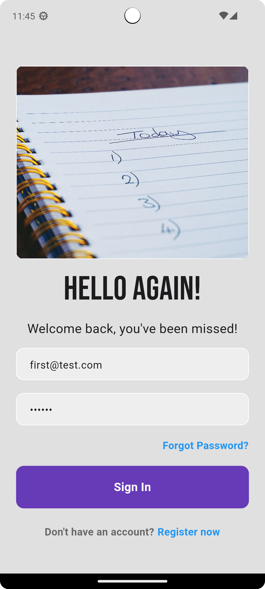
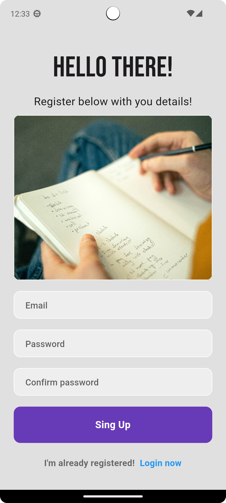
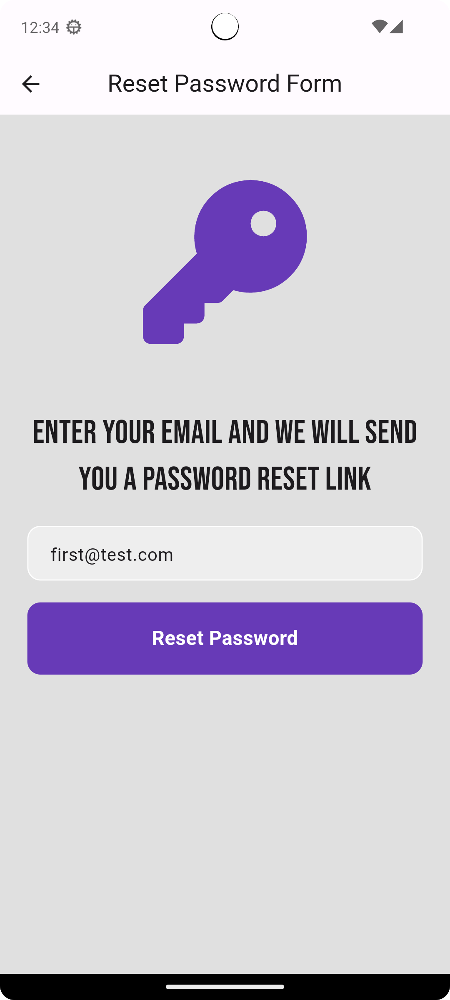
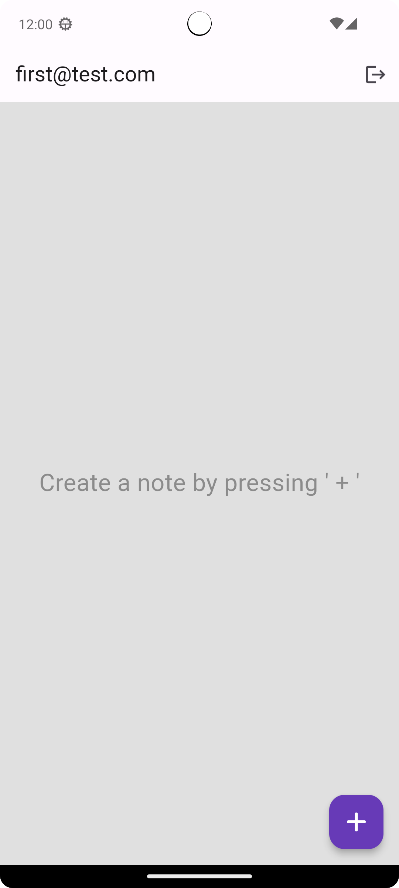
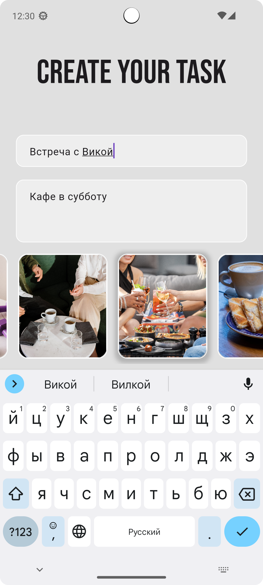
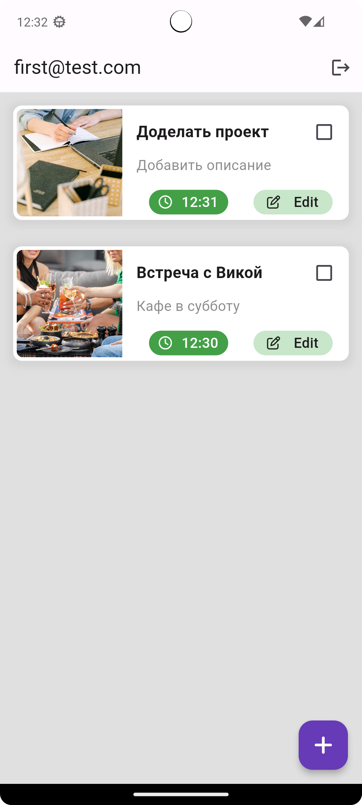
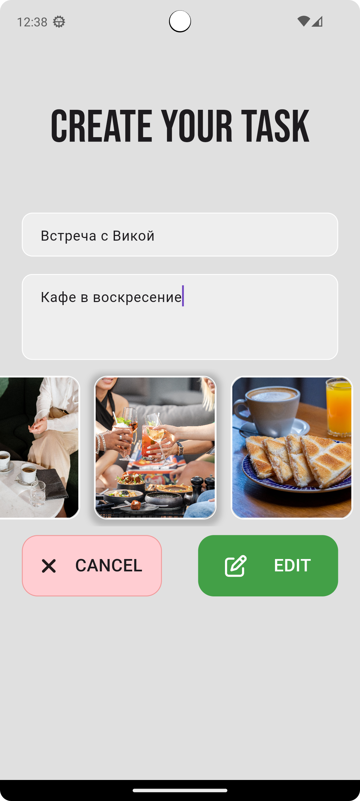
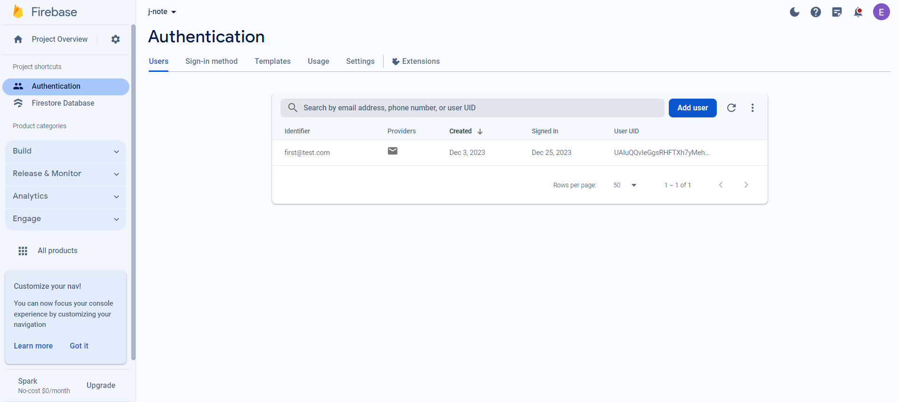
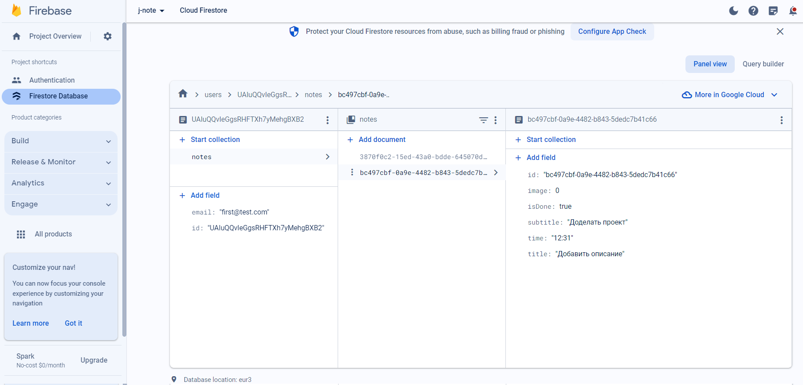

# j_note

# Описание проекта

**Проект записной книжки с использованием хранилища Firebase и возможностью аутентификации через Firebase Authentication. Проект создавался с целью ознакомления и изучения Firebase. Фрэймворк Flutter.**

## Скриншоты приложения

|        Экран входа в приложение        |      Экран регистрации пользователя       |       Сброс пароля пользователя        | 
|:--------------------------------------:|:-----------------------------------------:|:--------------------------------------:|
|  |  |  | 

|               Начальный экран               |           Создание заметки            |            Список заметок            |
|:-------------------------------------------:|:-------------------------------------:|:------------------------------------:|
|  |  |  |

|             Выполненые задачи             |       Редактирование заметки        |
|:-----------------------------------------:|:-----------------------------------:|
|  |  |

## Скриншоты из консоли Google Firebase

